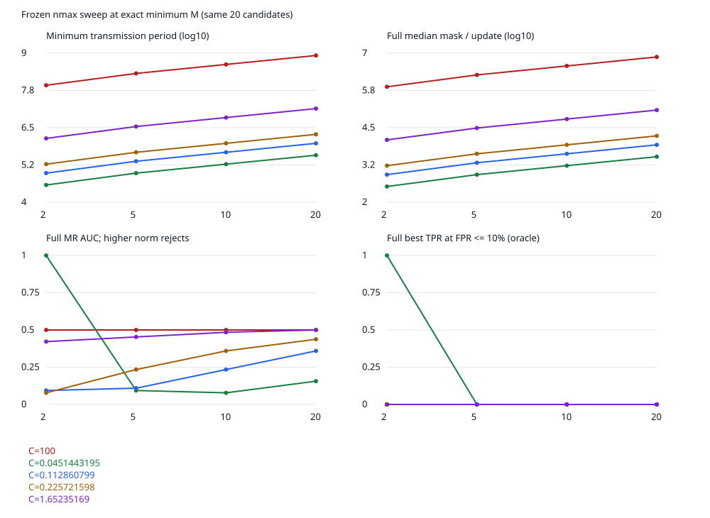

# Single-Y masked-L2 MGF feasible-region audit — 2026-10-09

## 1. Executive conclusion

현재 source adapter의 decoder·predicate·bootstrap·history를 유지한 공개 LeNet5/FashionMNIST/MR 실험이다. 본 보고서의 명시적 통계 기준은 AUC≥0.8, oracle TPR@FPR≤10%≥50%, 실제 r4 정상 acceptance≥50%, 정상 total/mask 순위 상관≤0.9, 선택 인원≤nmax, MR도 C 내, exact mismatch=0이다. 이는 이 보고서의 보수적 실용성 기준이지 논문 정리/보안 기준이 아니다.

- 검사한 조합: **100** = 4 nmax × 5 C × 5 period 배수. 신규 runtime 변경 없음.
- 위 조건을 모두 충족한 scope/조합: **0**. Score-only potential: **14**.
- 정상 capacity fixture 및 실제 MGF 선택 합: **1,104회 / 68,123,424좌표**, mismatch=0, 최대 실현 E=6.

### 최우선 여섯 질문

1. nmax20/C100: Mmin=840,000,021, M/(dS)=4000, full mask/update median=7479332, AUC=0.5, low-FPR TPR=0.0. 마스크가 실제 update보다 크고 기존 낮은 bootstrap cutoff가 지속된다.
2. C100에서 nmax20→2: full rho 7479332→747933.2, 거의 10배 감소하지만 AUC는 0.5→0.5, low-FPR TPR은 0.0. 분리 개선은 없다.
3. nmax20에서 C100→0.04514432: full rho=3373.365, full/projection AUC=0.15625/0.578125, low-FPR TPR=0.0/0.0. 정상 관측 기반 envelope이며 enforcement 증명이 아니다.
4. 동시 감소의 최선 full score-only 사례: nmax=2, C=0.04514432, M=37887, AUC=1.0, TPR@10%=1.0. 실행 가능한 현재 정책/정상 acceptance/MR 범위와는 별도다.
5. 작은 nmax는 현재 20-candidate bootstrap와 선택 상한이 충돌할 수 있다. 작은 C는 MR에도 강제돼야 하며, envelope 밖 attack score를 valid secure aggregate로 간주하지 않았다.
6. **현재 정책 전체의 실용적 유지에는 부정적이다.** 작은-envelope score-only 분리는 확인했지만 실행성·normal acceptance·MR bound까지 동시에 확인한 추천 profile은 얻지 못했다. 조건부 연구 후보와 runtime-ready 설정을 구분한다.

## 2. Question and scope

기준 문서는 docs/reproduction의 design-independent-review-2026-10-09.md, source-profile-integration-2026-10-09.md, mgf-scope-comparison-2026-10-09.md, mgf-fpr-diagnosis-2026-10-09.md이며 처음부터 끝까지 읽고 실제 source와 대조했다.

하나의 raw Y=du+scale_M(h)를 Secure Aggregation/MGF가 공유할 때 bounded exact recovery와 high-norm MR discrimination이 양립하는가? Universal impossibility는 주장하지 않는다. Oracle는 알려진 라벨을 쓰는 사후 통계이고 실제 threshold를 튜닝하지 않았다.

## 3. Frozen assumptions

p=14760426300877770769, q=73802131504388853845, S=10000, d=21; J=[60856,61696), D=61706. 기존 full-q 공개 keys, seed0, dataset/partition/model/optimizer/local hyperparameters, MR steps120/boost20/poisonbatch6 유지.
20명의 **후보 전원**을 모든 score 비교에 사용했다. nmax는 selected aggregate capacity다. `paper_codec` 및 `selection_statistics`는 기존 bootstrap에서 후보 ≥20명을 요구한다. 따라서 2/5/10명 후보 FL 실행을 새로 만들어 통과시키지 않았다. 선택 count>nmax는 명시적 실패이며 cap하지 않는다. 표의 acceptance는 MGF eligible fraction이다. continuation=false이면 해당 fraction만큼 실제 집계했다는 뜻이 아니다.

코드 대응: source_profiles.TransmissionCodec/validate_profile/transmission_error/scale_mask; source_paper_numeric.selection_statistics/select_masked/recover; paper_dmc.round_even/public_mgf_term/evolve_bound. 기존 source 함수를 직접 호출했으며 새 decoder나 history 함수를 만들지 않았다. full-vector predicate는 paper에 더 가깝지만 actual-mask-sum history는 paper-hprf와 달라 Algorithm 6 완전 재현은 아니다.

## 4. Existing baseline

기존 scope 보고서: full benign r4 rejection90%, projection25%; full/proj MR rejection100/25%; full high-norm oracle AUC0.5. 1,604,356 좌표 exact-match 진단은 기존 결과이며 신규 좌표 수에 더하지 않는다. 기존 커밋69844a2를 기준으로 새로운 연구 스크립트·테스트·artifact만 추가했다.

## 5. Observed benign/MR update ranges

| Context | abs max | p99.9 | p99 | p95 | median |
|---|---:|---:|---:|---:|---:|
| shared-frozen-benign | 0.02134228 | 0.003423525 | 0.001481146 | 0.0006569811 | 5.685538e-05 |
| shared-frozen-MR-r4 | 0.8261758 | 0.4223822 | 0.1771751 | 0.06608235 | 0.00653364 |
| previous-closed-benign-projection | 0.02257216 | 0.003353583 | 0.001447306 | 0.0006444305 | 5.61364e-05 |
| previous-closed-benign-full-vector | 0.02045941 | 0.003526945 | 0.00151129 | 0.0006609093 | 5.56726e-05 |

후보 Cbenign,max=0.02257216; frozen 및 기존 두 closed benign trajectory 전체 최대값에서 선정했다.
C=100, 2×/5×/10×benign,max, 추가 2×MR,max control. C 선택은 오라클 결과를 보기 전에 결정했다. Client/round/parameter-layer 최대와 percentile은 update_ranges.json에 있다. 새로운 clipping/공격 magnitude 변경 없음.

## 6. Exact feasible-M derivation

\[ B_u=\operatorname{RoundEven}(SC),\quad E_H=\lfloor2(n+1)/5\rfloor,\quad \bar E(n,M)=\left\lfloor\frac{(n+1)(p-1)+2ME_H}{2p}\right\rfloor.\]

\[d>2\bar E(n,M),\qquad 2(dnB_u+\bar E(n,M))<M.\]

M0=2dnBu+1부터 Mnext=2(dnBu+E(M))+1로 exact monotone lower-bound iteration한다. E는 비감소이고 모든 feasible M은 각 lower bound 이상이어야 한다. fixed point와 인접 M−1 실패를 확인한다. Spacing이 lower bound에서 실패하면 더 큰 M도 실패한다. 각 배수는 ceil로 정수화하고 기존 validate_profile로 재검증했다. runtime 파라미터 자동 resizing이 아니라 독립 실험의 명시적 설계변수다.

\[ \alpha_{\min}=M_{\min}/(dSp),\quad \alpha_{\min}p=M_{\min}/(dS)=2nB_u/S+(2\bar E+1)/(dS).\]

최소 period의 strict envelope margin은 작은-M 영역에서 1/2 transmission integer이다. 각 alpha/envelope margin/E/n/C는 case JSON에 exact Fraction으로 기록했다.

## 7. nmax sweep

같은 C=100, M=Mmin; 기존 candidate20/선택 capacity를 구분한다.

| nmax | Mmin | M/(dS) | full mask/update | full AUC | TPR@FPR10 | r4 benign acceptance / continuation |
|---:|---:|---:|---:|---:|---:|---|
| 2 | 84000003 | 400 | 747933.2 | 0.5 | 0.0 | 0.1 / True |
| 5 | 210000007 | 1000 | 1869833 | 0.5 | 0.0 | 0.1 / True |
| 10 | 420000011 | 2000 | 3739666 | 0.5 | 0.0 | 0.1 / True |
| 20 | 840000021 | 4000 | 7479332 | 0.5 | 0.0 | 0.1 / True |



## 8. C sweep

| C label (nmax20) | C | Mmin | model mask period | full rho | full AUC | proj AUC | full/proj actual r4 acceptance |
|---|---:|---:|---:|---:|---:|---:|---|
| current | 100 | 840000021 | 4000 | 7479332 | 0.5 | 0.53125 | 0.1/0.75 |
| 2x-benign-max | 0.04514432 | 378861 | 1.8041 | 3373.365 | 0.15625 | 0.578125 | 0.2/0.6 |
| 5x-benign-max | 0.1128608 | 948381 | 4.5161 | 8444.352 | 0.359375 | 0.53125 | 0.15/0.7 |
| 10x-benign-max | 0.2257216 | 1895901 | 9.0281 | 16881.04 | 0.4375 | 0.53125 | 0.15/0.75 |
| 2x-MR-max-control | 1.652352 | 13880181 | 66.0961 | 123588.7 | 0.5 | 0.53125 | 0.1/0.75 |

## 9. 2D feasible-region analysis

각 cell: feasible Mmin / model-unit period / full rho / full AUC / projection AUC. 이는 decoder envelope feasibility이며 protocol viability 표시가 아니다.

| nmax | 10x-benign-max | 2x-MR-max-control | 2x-benign-max | 5x-benign-max | current |
|---:|---|---|---|---|---|
| 2 | ✓ 189591 / 0.9028143 / 1688.112 / 0.078125 / 0.796875 | ✓ 1388019 / 6.609614 / 12358.87 / 0.421875 / 0.53125 | ✓ 37887 / 0.1804143 / 337.3446 / 1.0 / 1.0 | ✓ 94839 / 0.4516143 / 844.4432 / 0.09375 / 1.0 | ✓ 84000003 / 400 / 747933.2 / 0.5 / 0.53125 |
| 5 | ✓ 473977 / 2.257033 / 4220.275 / 0.234375 / 0.546875 | ✓ 3470047 / 16.52403 / 30897.18 / 0.453125 / 0.53125 | ✓ 94717 / 0.4510333 / 843.357 / 0.09375 / 1.0 | ✓ 237097 / 1.129033 / 2111.104 / 0.109375 / 0.75 | ✓ 210000007 / 1000 / 1869833 / 0.5 / 0.53125 |
| 10 | ✓ 947951 / 4.514052 / 8440.523 / 0.359375 / 0.53125 | ✓ 6940091 / 33.04805 / 61794.33 / 0.484375 / 0.53125 | ✓ 189431 / 0.9020524 / 1686.687 / 0.078125 / 0.796875 | ✓ 474191 / 2.258052 / 4222.18 / 0.234375 / 0.546875 | ✓ 420000011 / 2000 / 3739666 / 0.5 / 0.53125 |
| 20 | ✓ 1895901 / 9.0281 / 16881.04 / 0.4375 / 0.53125 | ✓ 13880181 / 66.0961 / 123588.7 / 0.5 / 0.53125 | ✓ 378861 / 1.8041 / 3373.365 / 0.15625 / 0.578125 | ✓ 948381 / 4.5161 / 8444.352 / 0.359375 / 0.53125 | ✓ 840000021 / 4000 / 7479332 / 0.5 / 0.53125 |

5 periods=Mmin×{1,1.25,1.5,2,4} 전부 검증했다. 모든 상세 값은 region.csv/summary.json에 보존했다.

## 10. Mask/update decomposition

범위별 Lupdate/Lmask/Ltotal와 rho의 min/median/mean/max/p95, mask-square/total-square 및 exact interaction을 case JSON에 기록했다. Signed cross term 때문에 mask-square fraction이 1보다 클 수도 있다. 모든 계산은 source와 같은 integer mask/nearest-even quantization을 사용한다.

## 11. Ranking domination

| Scope | total/mask Spearman min / max | total/update Spearman min / max |
|---|---|---|
| projection | 1 / 1 | -0.17593985 / -0.17593985 |
| full-vector | 0.992481203 / 1 | 0.0571428571 / 0.0751879699 |

## 12. Oracle benign/MR separability

현재 방향은 high norm rejects로 고정했다. 모든 exact score cutoff 및 AUC tie 처리, TPR@FPR≤0/5/10/25%, TPR100의 minimum FPR은 case JSON의 oracle에 있다. MR clients0..3와 동일 key/mask의 정상 counterpart ΔL/relative ΔL/update norm ratio도 보존했다. 표본은 benign16/MR4이며 FPR의 최소 양의 단계는 6.25%, TPR 단계는 25%다. 따라서 FPR≤5%는 이 표본에서 FPR=0과 같고, 여러 seed의 통계적 robustness로 해석하지 않는다.

| Best scope-only case | nmax | C | M | AUC | TPR@10 | normal r4 acceptance | continued | MR inside C |
|---|---:|---:|---:|---:|---:|---:|---|---|
| full | 2 | 0.04514432 | 37887 | 1.0 | 1.0 | 1 | False | False |
| proj | 2 | 0.04514432 | 37887 | 1.0 | 1.0 | 0 | False | False |

동일 mask의 paired norm-square 차이는 다음과 같다. 마스크 energy 자체는 두 값의 차이에서 상쇄되지만, client별 mask norm 분포 및 signed cross term이 공격 signal을 가리거나 방향을 뒤집을 수 있다.

\[ L_{MR}^2-L_{clean}^2=(\|u_{MR}/S\|^2-\|u_{clean}/S\|^2)+2\langle m/(dS),(u_{MR}-u_{clean})/S\rangle.\]

높은 M에서 MR의 update norm이 크더라도 negative cross term으로 total norm이 작아질 수 있다. 이는 기존 high-norm predicate의 의미를 유지한 결과이며 낮은 norm을 reject하도록 방향을 바꾸지 않았다.

| nmax2, C=2x benign max | M | full paired median ΔL | full AUC | projection paired median ΔL | proj AUC |
|---|---:|---:|---:|---:|---:|
| 1×Mmin | 37887 | 0.868427899 | 1.0 | 1.04046018 | 1.0 |
| 5/4×Mmin | 47359 | 0.495920873 | 1.0 | 0.876956433 | 1.0 |
| 3/2×Mmin | 56831 | 0.243226579 | 0.953125 | 0.752716318 | 1.0 |
| 2×Mmin | 75774 | -0.0757464754 | 0.390625 | 0.582675155 | 1.0 |
| 4×Mmin | 151548 | -0.556773437 | 0.0625 | 0.300275717 | 0.90625 |

Score-only 개선은 현재 decoder+bootstrap+enforcement까지 실행 가능한 profile의 증거가 아니다. 무조건 분리가 없다는 주장도 하지 않는다. 정상 mask/update ratio≫1 또는 정상 순위의 mask 지배 **하나만으로** 공격 분리 불가능을 증명할 수 없다. 작은 envelope에서 AUC1이 나온 것이 직접적인 반례다. Joint 판단은 actual policy/범위/복원 결과를 함께 사용한다.

## 13. Closed-loop MGF behavior

이번 100-case 비교는 **동일 기존 frozen trajectory의 r1–r4 history/selection replay**다. 파라미터마다 새 모델을 학습했다고 주장하지 않는다. 기존 두 실제 benign closed-loop는 재학습·model/update hash 대조로 update 범위를 측정했다. 새 scope/parameter에서 선택 count>nmax 또는 survivors<2는 failure를 그대로 기록한다. Stop 이후 가짜 b4/history를 생성하지 않는다. Oracle r4는 stop 여부와 무관한 score-only diagnostic이다. 선택 subset, b_r,T_r,T_r/Tprev, rejection/continuation은 각 case.replay에 있다.

추가 확인은 별도 check_mgf_region_closed_loop.py로 **새 local selected-model feedback**을 수행했다. 정상 최대값 기반 최소 period의 n2-full/n10-projection/n20-both와 MR-inclusive n20 control을 사전 선택했다. Primary frozen 비교와 달리 이후 모델/update가 다를 수 있으므로 같은 update 점수 비교로 합치지 않는다.

| C envelope | nmax | scope | MR | completed rounds | last eligible fraction | last MR TPR | test accuracy | stop |
|---|---:|---|---|---:|---:|---:|---:|---|
| 0.04514432 | 2 | full-vector | False | 3 | 0 | — | 0.88 | insufficient-valid |
| 0.04514432 | 10 | projection | False | 4 | 0.45 | — | 0.886 | — |
| 0.04514432 | 20 | projection | False | 4 | 0.6 | — | 0.8862222 | — |
| 0.04514432 | 20 | full-vector | False | 3 | 0.05 | — | 0.88 | insufficient-valid |
| 1.652352 | 20 | projection | False | 4 | 0.75 | — | 0.8866667 | — |
| 1.652352 | 20 | projection | True | 4 | 0.75 | 0.25 | 0.1007778 | — |
| 1.652352 | 20 | full-vector | False | 4 | 0.1 | — | 0.8795556 | — |
| 1.652352 | 20 | full-vector | True | 4 | 0.125 | 1 | 0.8795556 | — |

작은 C 밖의 MR는 기존 encoder 전제를 위반하므로 signed attack loop 성공으로 세지 않는다. MR-inclusive control만 정상 4라운드가 진행 가능할 때 같은 공격의 새 closed loop를 실행했다.

## 14. Recovery exactness

1,104개 정상 aggregate, 68,123,424coordinate comparisons, mismatch=0; 최대 |E|=6, 최소 실현 capacity margin=33267/2.
20개 후보 중 ID0..nmax−1의 honest arithmetic capacity fixture와 실제 MGF selected aggregate를 분리한다. 전자도 decoder 전 좌표를 실행하지만 실제 MGF 선택처럼 표현하지 않는다. Raw Y를 보존하며 %M→center→RoundEven은 불변. MR가 C 밖인 case의 exact correctness는 주장하지 않는다. Runtime 파일들의 전후 hash는 모두 동일하다.
추가 attack-inclusive envelopes: 85회 / 5,245,010좌표, mismatch=0. 새 closed-loop 확인: 1,851,180좌표, mismatch=0. 이들은 위 primary 복원 건수와 분리했으며 전수 key/security 검증을 뜻하지 않는다.
작은 C의 60조합에서 unchanged MR는 C 밖이었다. 기존 check_vectors의 numeric 조건 −dBu≤Y≤M+dBu+1도 60조합에서 MR client 한 명 이상이 위반했다. MR_wire_bounds.json에 client별 위반 좌표 수를 기록했다. 이는 unsigned numeric subcheck이며 전체 signature/BFT 공격 실행 결과가 아니다. 좋은 score-only AUC를 authenticated protocol 방어 성능으로 쓰지 않는다.

## 15. Trade-offs

작은 C는 현재 honest source encoder/metadata validator에서 거부할 수 있는 envelope다. 그러나 악성 client가 same-key masked Y에 실제로 C를 지켰음을 암호학적으로 증명하지 못한다. C를 security assumption으로 쓰려면 clipping enforcement/commitment-range proof/ZKP 등 추가 binding 검토가 필요하며 여기서 구현하지 않았다. 작은 selected capacity는 평균의 표본 수·update variance·non-IID 민감도와 privacy/anonymity set에 영향을 준다. 이번 실험은 그 비용의 장기 수렴이나 privacy theorem을 측정하지 않았다. 반복 작은 집합 및 현재 ASR aggregate-key multi-round leakage 위험은 별도로 남는다. 후보 20명과 data allocation은 그대로여서 nmax 감소를 client training/communication이 자동으로 줄어든 실험으로 해석하지 않는다. 2x/5x/10x observed bound는 이후 라운드나 다른 모델에서도 지켜진다는 보장이 아니다. 100조합의 best oracle 결과는 사후 탐색 결과이며 새 seed/keys/holdout의 검증 성능으로 주장하지 않는다.

## 16. Can the current MGF be retained?

Clearly viable 기준을 모두 충족한 조합=0. 정확 복원, oracle score 분리, 기존 실제 selection usability, malicious envelope를 따로 판정한다. 좋은 AUC가 작은 nmax/C에서 나와도 current bootstrap/history가 실용적 acceptance를 만들었다고 대체하지 않는다. 작은 C의 out-of-envelope MR에 대한 score-only 관측으로 active adversary recovery를 승인하지 않는다.

HPRF scalar privacy/raw-output inversion/r+block overlap/full-q security, multi-round aggregate key leakage, share-mask inconsistency, actual-mask-sum!=paper-hprf, weighted FedAvg unsupported, production security not established.

## 17. Recommended next step

우선 이 report의 작은-envelope score-only potential과 actual selection/enforcement 실패를 분리해 결정한다. 실험에서 current policy 전체를 유지할 유용한 profile이 확인되지 않으면, 다음 단 하나의 작업은 새 구현이 아니라 **enforce 가능한 coordinate bound를 정의하고 검증/집계 binding 요구사항을 명세하는 것**이다. 별도 signal, range proof/ZKP, sketch proof, 다른 poisoning predicate는 후속 설계 후보일 뿐 여기서 도입하지 않았다.

### Reproduction and artifacts

```bash
env PYTHONDONTWRITEBYTECODE=1 \
  PYTHONPATH=.cache/flower-deps:.cache/author-asr-deps:.cache/torch-deps:. \
  python3 experiments/audit_mgf_feasible_region.py
# Printed output directory를 $region_dir에 지정한 뒤:
python3 experiments/check_mgf_region_attack_recovery.py "$region_dir"
python3 experiments/check_mgf_region_closed_loop.py "$region_dir"
python3 experiments/report_mgf_feasible_region.py "$region_dir"
```

각 run은 새 timestamp 디렉터리다. 입력/reference/data/source hashes는 기존 ledger를 먼저 검증한다. config/update_ranges/100 case JSON/region.csv/summary/feasibility/recovery_summary 및 SHA256을 보존한다. 본 문서의 표는 저장된 ledger를 renderer로 생성한 값이며 임의 threshold/공격 변경 없음.

보고서 formatter 검증에서 상대경로 처리 및 SCOPES import 누락을 고쳤다. 실험 수치/parameter/runtime 또는 기존 결과 파일을 변경해서 해결한 오류가 아니다.

### Test verification

최종 관련 fresh-process suite: **361 passed / 0 failed / 0 skipped**, 43.56초. 기존 관련335 + 새 helper18 + 새 artifact8이다. Typer/Click 기존 deprecation warning2개. 전체 repository suite 재실행이라고 주장하지 않는다. 이전 개발 실행227/353/26은 중복이므로 합산하지 않았다. verification.json에 명령과 실행 구분을 남겼다. runtime 및 기준 문서 변경 없음, git diff --check 통과.

### 최종 분류

- **A / Clearly viable:** 위 동시 조건을 만족한 조합 없음.
- **B / Marginal, workload-dependent:** 작은 nmax/C에서 score-only 분리는 나타난다. 예를 들어 nmax10/projection의 AUC≈0.797, low-FPR TPR50%이지만 현재 FPR56.25%, MR는 C 밖이고 정상 mask-only ranking이 지배한다. 즉 conditional research potential이지 사용 승인 아님.
- **C / Not viable under current executable envelope:** unchanged MR까지 C 내인 검사 조합에서 낮은 FPR의 분리 개선을 관측하지 못했다. 작은 C의 좋은 oracle만으로 현재 runtime 유지 가능을 주장할 수 없다.

**결론 3 — 현재 조건 그대로는 유지 어려움.** 이 workload·HPRF·공격·decoder·bootstrap/history 및 테스트한 실행 가능한 범위에서 recovery correctness와 실용적인 MR 분리를 함께 만족하는 parameter를 확보하지 못했다. 이는 ‘모든 parameter에서 meaningful score separation이 없다’는 주장이 아니다. 작은 counterfactual envelope의 AUC1.0은 실제 관측됐지만 capacity/threshold/강제 범위를 함께 만족하지 않았다. 새로운 predicate를 구현하거나 current MGF 코드를 삭제하지 않았고 다른 Aion 구성·workload의 불가능성도 주장하지 않는다.
